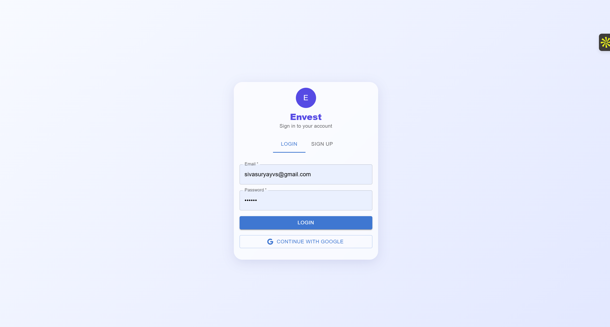
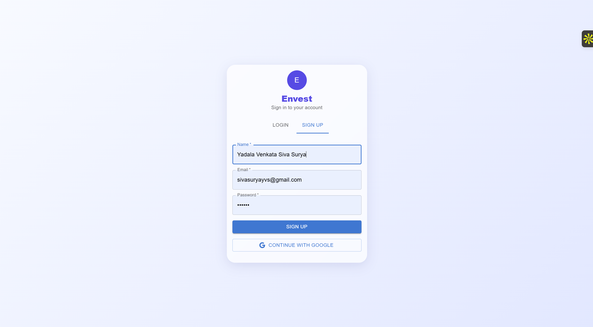
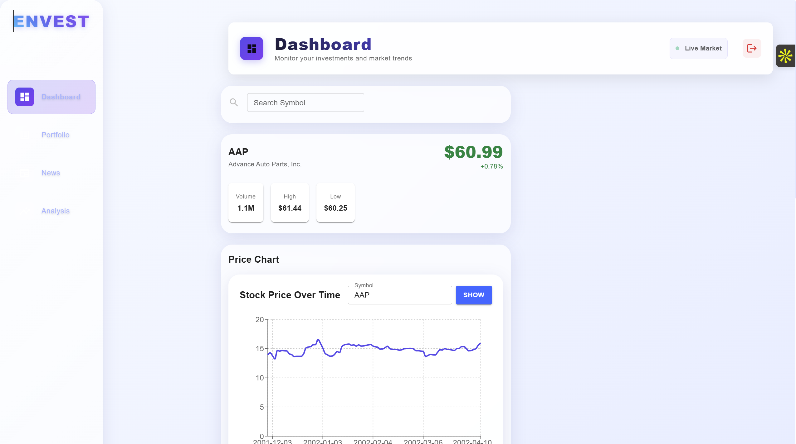
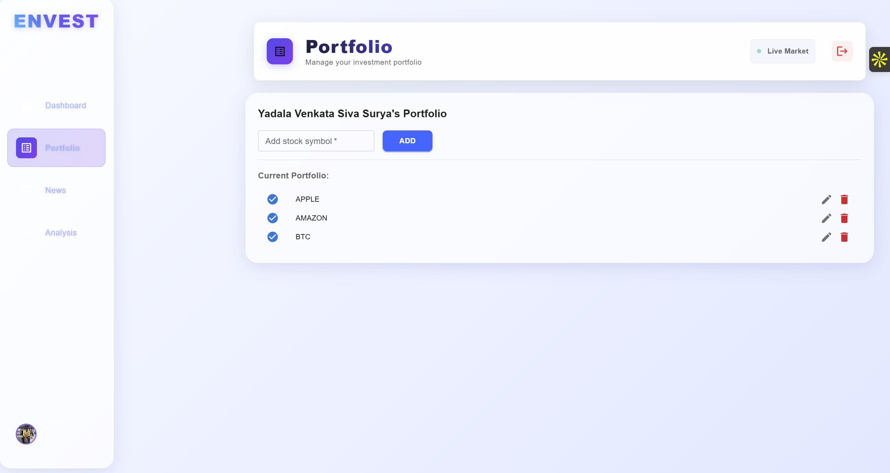
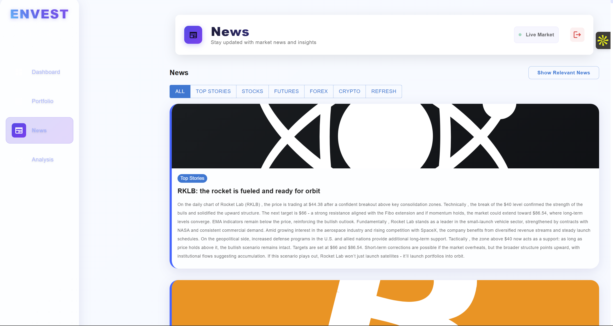
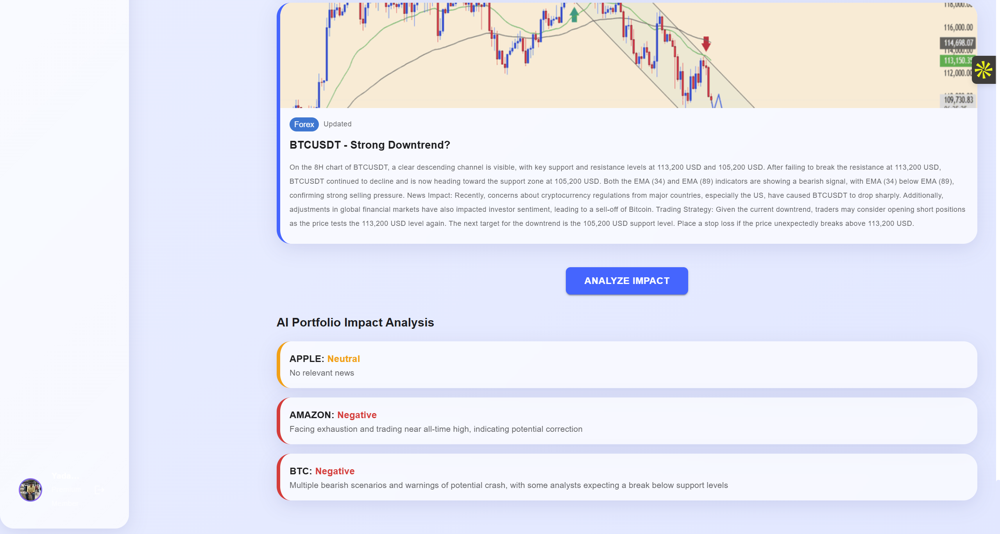
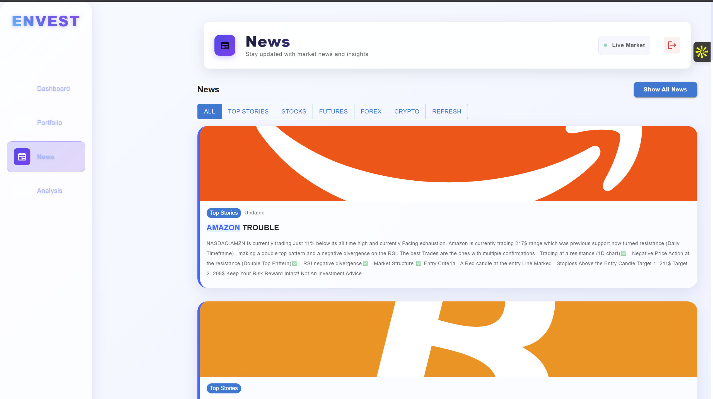

# 🚀 Envest - Intelligent Investment Analysis Platform

[](https://siva-frontend.onrender.com/)
[](https://reactjs.org/)
[](https://nodejs.org/)
[](LICENSE)

> **Envest** is a comprehensive investment analysis platform that combines real-time market data, AI-powered insights, and portfolio management tools to help investors make informed decisions.

## 🌟 Live Demo

**🔗 Frontend Application:** [https://siva-frontend.onrender.com/](https://siva-frontend.onrender.com/)

## 📸 Screenshots

### 🔐 Authentication Pages

*Clean and modern login interface with purple "E" logo, email/password fields, and Google OAuth integration*


*User registration form with name, email, password fields and "CONTINUE WITH GOOGLE" button*

### 🏠 Dashboard Overview

*Main dashboard showing stock search for AAP, real-time price data ($60.99, +0.78%), and interactive price charts*

### 💼 Portfolio Management

*Portfolio management interface displaying current holdings (APPLE, AMAZON, BTC) with add/remove functionality*

### 📰 News & Insights

*Comprehensive news section with category filters (ALL, TOP STORIES, STOCKS, FUTURES, FOREX, CRYPTO) and detailed market analysis*

### 📊 AI Portfolio Impact Analysis

*AI-powered analysis dashboard with BTCUSDT candlestick charts and portfolio sentiment analysis for APPLE, AMAZON, BTC*

### 📰 Show Portfolio Relevant News

*AI-powered analysis dashboard with BTCUSDT candlestick charts and portfolio sentiment analysis for APPLE, AMAZON, BTC*

## ✨ Key Features

### 🎯 **Core Functionality**
- **Real-time Stock Data**: Live market prices, volume, and price changes
- **AI-Powered Analysis**: Intelligent insights and recommendations using OpenAI
- **Portfolio Tracking**: Comprehensive portfolio management and performance analysis
- **News Aggregation**: Curated financial news from multiple sources
- **Technical Analysis**: Advanced charting and analysis tools

### 🔍 **Advanced Features**
- **Symbol Search**: Quick stock symbol lookup and validation
- **Stock Profiles**: Detailed company information and financial metrics
- **News Filtering**: Personalized news based on portfolio holdings
- **Performance Analytics**: Historical performance tracking and analysis
- **Responsive Design**: Mobile-friendly interface for all devices

### 🛠 **Technical Capabilities**
- **Web Scraping**: Automated data collection from financial websites
- **API Integration**: Multiple financial data providers (FMP, TradingView)
- **Real-time Updates**: Live data streaming and notifications
- **Secure Authentication**: JWT-based user authentication system

## 🏗️ Project Structure

```
Envest/
├── frontend/                 # React.js Frontend Application
│   ├── src/
│   │   ├── components/      # Reusable UI Components
│   │   │   ├── AnalysisGraph.js
│   │   │   ├── AnalysisSummary.js
│   │   │   ├── FilteredNews.js
│   │   │   ├── HeroSection.js
│   │   │   ├── HTNewsTable.js
│   │   │   ├── LoginSignup.js
│   │   │   ├── Navbar.js
│   │   │   ├── NewsCard.js
│   │   │   ├── NewsList.js
│   │   │   ├── PortfolioInput.js
│   │   │   ├── StockArticles.js
│   │   │   ├── StockNews.js
│   │   │   ├── StockProfile.js
│   │   │   ├── StockRatings.js
│   │   │   ├── SymbolSearch.js
│   │   │   └── TradingViewNewsTable.js
│   │   ├── utils/           # Utility Functions
│   │   ├── App.js          # Main Application Component
│   │   └── index.js        # Application Entry Point
│   ├── public/              # Static Assets
│   └── build/               # Production Build
├── backend/                  # Node.js Backend Server
│   ├── routes/              # API Endpoints
│   ├── models/              # Database Models
│   ├── config/              # Configuration Files
│   ├── utils/               # Backend Utilities
│   └── server.js            # Main Server File
└── README.md                # Project Documentation
```

## 🚀 Technology Stack

### **Frontend**
- **React 19.1.0** - Modern UI framework with hooks
- **Material-UI (MUI)** - Professional component library
- **Recharts** - Data visualization and interactive charts
- **Axios** - HTTP client for API communication
- **Emotion** - CSS-in-JS styling solution

### **Backend**
- **Node.js** - Server runtime environment
- **Express.js** - Fast, unopinionated web framework
- **MongoDB** - NoSQL database with Mongoose ODM
- **JWT** - JSON Web Token authentication
- **Puppeteer** - Web scraping and automation
- **OpenAI API** - AI-powered financial insights

### **External APIs & Services**
- **Financial Modeling Prep (FMP)** - Comprehensive financial data
- **TradingView** - Professional market analysis tools
- **Kite Connect** - Zerodha trading platform integration
- **Render** - Cloud hosting platform

## 📋 Prerequisites

Before running this project, ensure you have:

- **Node.js** (v16 or higher)
- **npm** or **yarn** package manager
- **MongoDB** database (local or cloud)
- **API Keys** for external services

## 🛠️ Installation & Setup

### 1. Clone the Repository
```bash
git clone https://github.com/Siva-surya-yadala-venkata/Envest
cd envest
```

### 2. Backend Setup
```bash
cd backend
npm install

# Create .env file
cp .env.example .env

# Configure environment variables
REACT_APP_BACKEND_URL=http://localhost:5000
REACT_APP_FMP_API_KEY=your_fmp_api_key
MONGODB_URI=your_mongodb_connection_string
JWT_SECRET=your_jwt_secret
OPENAI_API_KEY=your_openai_api_key

# Start the server
npm start
```

### 3. Frontend Setup
```bash
cd frontend
npm install

# Create .env file
cp .env.example .env

# Configure environment variables
REACT_APP_BACKEND_URL=http://localhost:5000
REACT_APP_FMP_API_KEY=your_fmp_api_key

# Start the development server
npm start
```

### 4. Access the Application
- **Frontend**: http://localhost:3000
- **Backend API**: http://localhost:5000

## 🔧 Environment Variables

### Backend (.env)
```env
PORT=5000
MONGODB_URI=mongodb://localhost:27017/envest
JWT_SECRET=your_secret_key
OPENAI_API_KEY=your_openai_api_key
FMP_API_KEY=your_fmp_api_key
```

### Frontend (.env)
```env
REACT_APP_BACKEND_URL=http://localhost:5000
REACT_APP_FMP_API_KEY=your_fmp_api_key
```

## 📱 Available Scripts

### Backend
```bash
npm start          # Start the server
npm run dev        # Start in development mode
npm test           # Run tests
```

### Frontend
```bash
npm start          # Start development server
npm run build      # Build for production
npm test           # Run tests
npm run eject      # Eject from Create React App
```

## 🌐 API Endpoints

### Authentication
- `POST /api/auth/register` - User registration
- `POST /api/auth/login` - User login
- `GET /api/auth/profile` - Get user profile

### Stock Data
- `GET /api/stocks/profile/:symbol` - Get stock profile
- `GET /api/stocks/quote/:symbol` - Get real-time quote
- `GET /api/stocks/news/:symbol` - Get stock-related news

### Portfolio
- `GET /api/portfolio` - Get user portfolio
- `POST /api/portfolio/add` - Add stock to portfolio
- `DELETE /api/portfolio/:id` - Remove stock from portfolio

### Analysis
- `POST /api/analysis/generate` - Generate AI analysis
- `GET /api/analysis/history` - Get analysis history

## 🎨 UI Components

The application includes several reusable components:

- **SymbolSearch** - Stock symbol search with autocomplete
- **StockProfile** - Detailed stock information display
- **StockNews** - News feed for selected stocks
- **PortfolioInput** - Portfolio management interface
- **AnalysisGraph** - Data visualization charts
- **NewsCard** - Individual news article display
- **FilteredNews** - Personalized news filtering

## 🔒 Security Features

- **JWT Authentication** - Secure user sessions
- **Password Hashing** - bcrypt password encryption
- **CORS Protection** - Cross-origin request security
- **Environment Variables** - Secure configuration management
- **Input Validation** - Data sanitization and validation

## 🚀 Deployment

### Frontend (Render)
The frontend is deployed on Render:
- **URL**: https://siva-frontend.onrender.com/
- **Build Command**: `npm run build`
- **Publish Directory**: `build/`

### Backend
Deploy the backend to your preferred hosting service:
- **Heroku** - Easy deployment with Git integration
- **Railway** - Modern deployment platform
- **DigitalOcean** - Scalable cloud infrastructure
- **AWS** - Enterprise-grade cloud services

## 🤝 Contributing

We welcome contributions! Please follow these steps:

1. **Fork** the repository
2. **Create** a feature branch (`git checkout -b feature/AmazingFeature`)
3. **Commit** your changes (`git commit -m 'Add some AmazingFeature'`)
4. **Push** to the branch (`git push origin feature/AmazingFeature`)
5. **Open** a Pull Request


## 👨‍💻 Author

**Siva Surya** - [GitHub Profile](https://github.com/Siva-surya-yadala-venkata)

## 🙏 Acknowledgments

- **Financial Modeling Prep** for financial data APIs
- **TradingView** for market analysis tools
- **OpenAI** for AI-powered insights
- **Material-UI** for beautiful UI components
- **React Community** for the amazing framework

## 📞 Support

If you have any questions or need help:

- **Create an Issue** on GitHub
- **Email**: sivasuryayvs[at]gmail[dot]com
- **LinkedIn**: [Venkata Siva Surya Yadala](https://www.linkedin.com/in/yadala-venkata-siva-surya-1a1a3b256/)

---

⭐ **Star this repository if you find it helpful!**

🔗 **Live Demo**: [https://siva-frontend.onrender.com/](https://siva-frontend.onrender.com/)
